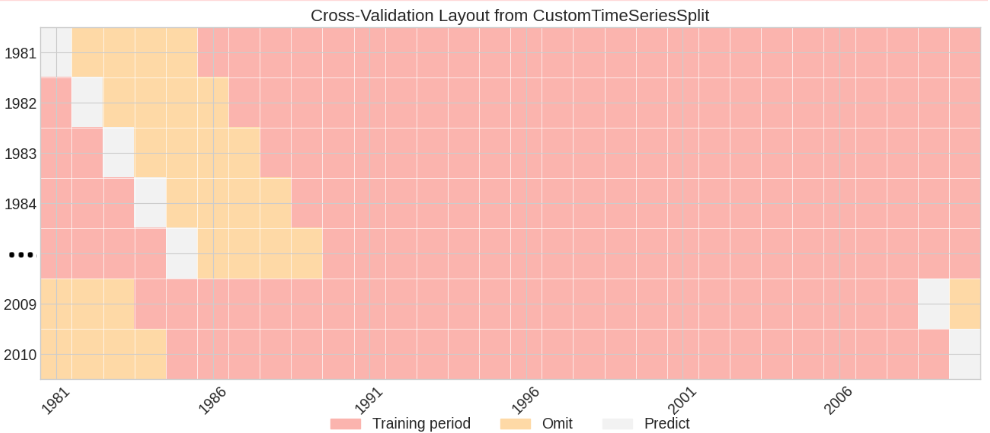
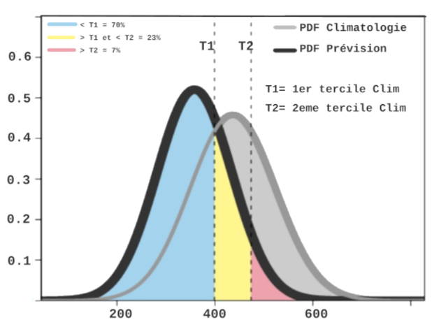

Models and Cross-Validation
===========================

wass2s provides a unified forecasting interface: every model class implements
the same three methods:

* ``compute_model(X_train, y_train, X_test, y_test, **kwargs)`` — fit on the
  training fold and predict the test period.
* ``compute_prob(Predictant, clim_year_start, clim_year_end, hindcast_det, **kwargs)``
  — convert a deterministic hindcast into tercile probabilities.
* ``forecast(Predictant, clim_year_start, clim_year_end, Predictor, hindcast_det, Predictor_for_year, **kwargs)``
  — operational forecast for one target year.

This uniformity means that any model can be swapped into
:ref:`cross-validation <cross-validation>` without changing the surrounding
code.

-------------------------------------------------------------------------------

.. _linear-models:

Linear Regression Models
-------------------------

All linear models are spatially distributed (one model per pixel or per
cluster), run in parallel via Dask, and produce both deterministic and
probabilistic (tercile) outputs.

Ordinary Least Squares — ``WAS_LinearRegression_Model``
~~~~~~~~~~~~~~~~~~~~~~~~~~~~~~~~~~~~~~~~~~~~~~~~~~~~~~~~~

A baseline OLS model with no regularisation. Fast, interpretable, and a good
first benchmark.

.. code-block:: python

   from wass2s import WAS_LinearRegression_Model

   model = WAS_LinearRegression_Model(nb_cores=4, dist_method="nonparam")

   hindcast = model.compute_model(X_train, y_train, X_test, y_test)
   prob = model.compute_prob(
       Predictant=obs, clim_year_start=1991, clim_year_end=2020,
       hindcast_det=hindcast
   )

Ridge — ``WAS_Ridge_Model``
~~~~~~~~~~~~~~~~~~~~~~~~~~~~~

L2-regularised regression. Useful when predictors are correlated (e.g.
multiple SST indices). The regularisation parameter ``alpha`` is optimised
per spatial cluster.

.. code-block:: python

   from wass2s import WAS_Ridge_Model
   import numpy as np

   ridge = WAS_Ridge_Model(
       n_clusters=6,
       alpha_range=np.logspace(-4, 0.1, 20),
       nb_cores=4,
       dist_method="nonparam"
   )

   alpha, clusters = ridge.compute_hyperparameters(
       predictand=y_train, predictor=X_train,
       clim_year_start=1991, clim_year_end=2020
   )
   hindcast = ridge.compute_model(X_train, y_train, X_test, y_test, alpha=alpha)

Lasso and LassoLars — ``WAS_Lasso_Model``, ``WAS_LassoLars_Model``
~~~~~~~~~~~~~~~~~~~~~~~~~~~~~~~~~~~~~~~~~~~~~~~~~~~~~~~~~~~~~~~~~~~~~

L1-regularised regression. Drives irrelevant predictor coefficients exactly
to zero, performing implicit feature selection. LassoLars uses the LARS
path algorithm and is more efficient when the number of features exceeds the
number of samples.

.. code-block:: python

   from wass2s import WAS_LassoLars_Model

   lasso = WAS_LassoLars_Model(n_clusters=10, nb_cores=4)
   hindcast = lasso.compute_model(X_train, y_train, X_test, y_test)

ElasticNet — ``WAS_ElasticNet_Model``
~~~~~~~~~~~~~~~~~~~~~~~~~~~~~~~~~~~~~~

Combines L1 (feature selection) and L2 (multicollinearity handling). Often
the most robust choice for climate indices predictors.

.. code-block:: python

   from wass2s import WAS_ElasticNet_Model

   enet = WAS_ElasticNet_Model(
       l1_ratio_range=[0.1, 0.5, 0.9],
       nb_cores=4
   )
   alpha, l1_ratio, clusters = enet.compute_hyperparameters(
       y_train, X_train, 1991, 2020
   )
   forecast_det, forecast_prob = enet.forecast(
       Predictant=y_train, clim_year_start=1991, clim_year_end=2020,
       Predictor=X_train, hindcast_det=hindcast,
       Predictor_for_year=X_next_year,
       alpha=alpha, l1_ratio=l1_ratio
   )

MARS — ``WAS_MARS_Model``
~~~~~~~~~~~~~~~~~~~~~~~~~~

Multivariate Adaptive Regression Splines. Fits piecewise linear functions
(hinges) and automatically selects relevant predictors and interactions.

.. code-block:: python

   from wass2s import WAS_MARS_Model

   mars = WAS_MARS_Model(nb_cores=4, max_terms=21, max_degree=2)
   hindcast = mars.compute_model(X_train, y_train, X_test, y_test)

Probabilistic output methods
~~~~~~~~~~~~~~~~~~~~~~~~~~~~~

All models accept a ``dist_method`` parameter controlling how deterministic
predictions are converted into tercile probabilities:

+----------------+------------------------------------------------------------+
| ``dist_method``| Description                                                |
+================+============================================================+
| ``nonparam``   | Non-parametric: rank historical cross-validation errors.   |
|                | No distribution assumption. *Default and recommended.*     |
+----------------+------------------------------------------------------------+
| ``normal``     | Gaussian distribution fitted to cross-validation errors.   |
+----------------+------------------------------------------------------------+
| ``gamma``      | Gamma distribution — suitable for precipitation.           |
+----------------+------------------------------------------------------------+
| ``lognormal``  | Log-normal distribution.                                   |
+----------------+------------------------------------------------------------+
| ``weibull_min``| Weibull distribution.                                      |
+----------------+------------------------------------------------------------+
| ``bestfit``    | Per-pixel best-fitting distribution from                   |
|                | ``WAS_TransformData.fit_best_distribution``.               |
+----------------+------------------------------------------------------------+

To use ``bestfit``, pass the distribution parameter arrays returned by
``WAS_TransformData``:

.. code-block:: python

   prob = model.compute_prob(
       Predictant=obs, clim_year_start=1991, clim_year_end=2020,
       hindcast_det=hindcast,
       best_code_da=best_code,
       best_shape_da=best_shape,
       best_loc_da=best_loc,
       best_scale_da=best_scale
   )

-------------------------------------------------------------------------------

.. _ml-models:

Advanced Machine-Learning Models
----------------------------------

These models are non-linear regressors that share the same interface as the
linear models above. Hyperparameters are optimised per spatial cluster.

Hyperparameter optimisation
~~~~~~~~~~~~~~~~~~~~~~~~~~~~~

All ML classes support three search strategies via ``optimization_method``:

* ``"grid"`` — exhaustive grid search (reliable but slow).
* ``"random"`` — randomised search (faster for large spaces).
* ``"bayesian"`` — Optuna TPE sampler (recommended for MLP, stacking).

Support Vector Regression — ``WAS_SVR``
~~~~~~~~~~~~~~~~~~~~~~~~~~~~~~~~~~~~~~~~~

.. code-block:: python

   from wass2s import WAS_SVR

   svr = WAS_SVR(
       nb_cores=4, n_clusters=5,
       kernel="rbf", optimization_method="bayesian", n_trials=30
   )
   C_map, eps_map, deg_map, clusters, kernel_map, gamma_map = \
       svr.compute_hyperparameters(y_train, X_train, 1991, 2020)

   forecast_det, forecast_prob = svr.forecast(
       Predictant=y_train, clim_year_start=1991, clim_year_end=2020,
       Predictor=X_train, hindcast_det=hindcast,
       Predictor_for_year=X_next_year,
       epsilon=eps_map, C=C_map,
       kernel_array=kernel_map, degree_array=deg_map, gamma_array=gamma_map
   )

Multi-Layer Perceptron — ``WAS_MLP``
~~~~~~~~~~~~~~~~~~~~~~~~~~~~~~~~~~~~~~

.. code-block:: python

   from wass2s import WAS_MLP

   mlp = WAS_MLP(
       nb_cores=4, n_clusters=4,
       optimization_method="random", n_trials=20
   )
   hl, act, solver, alpha, lr, maxiter, clusters = \
       mlp.compute_hyperparameters(y_train, X_train, 1991, 2020)

   forecast_det, forecast_prob = mlp.forecast(
       Predictant=y_train, clim_year_start=1991, clim_year_end=2020,
       Predictor=X_train, hindcast_det=hindcast,
       Predictor_for_year=X_next_year,
       hl_array=hl, act_array=act, lr_array=lr
   )

Stacking Ensemble — ``WAS_RandomForest_XGBoost_Stacking_MLP``
~~~~~~~~~~~~~~~~~~~~~~~~~~~~~~~~~~~~~~~~~~~~~~~~~~~~~~~~~~~~~~~

A two-layer ensemble: Random Forest and XGBoost as base learners, with an
MLP meta-learner trained on their out-of-fold predictions.

.. code-block:: python

   from wass2s import WAS_RandomForest_XGBoost_Stacking_MLP

   stacking = WAS_RandomForest_XGBoost_Stacking_MLP(
       nb_cores=4, n_clusters=3,
       optimization_method="bayesian", n_trials=15
   )
   best_params, clusters = stacking.compute_hyperparameters(
       y_train, X_train, 1991, 2020
   )
   forecast_det, forecast_prob = stacking.forecast(
       Predictant=y_train, clim_year_start=1991, clim_year_end=2020,
       Predictor=X_train, hindcast_det=hindcast,
       Predictor_for_year=X_next_year,
       best_param_da=best_params
   )

-------------------------------------------------------------------------------

.. _eof-pcr:

EOF Analysis and Principal Component Regression
-------------------------------------------------

EOF analysis (WAS_EOF)
~~~~~~~~~~~~~~~~~~~~~~~~

**Class**: ``WAS_EOF``

Performs Empirical Orthogonal Function decomposition on a spatial field.
Cosine-latitude weighting corrects for area distortion; optional linear
detrending removes any long-term signal before analysis.

.. code-block:: python

   from wass2s import WAS_EOF

   eof_solver = WAS_EOF(
       opti_explained_variance=90,   # Retain modes explaining ≥ 90 % variance
       detrend=True,
       use_coslat=True
   )
   eofs, pcs, exp_var, _ = eof_solver.fit(sst_anomaly_da, dim="T")
   eof_solver.plot_EOF(eofs, exp_var)

Principal Component Regression (WAS_PCR)
~~~~~~~~~~~~~~~~~~~~~~~~~~~~~~~~~~~~~~~~~~

**Class**: ``WAS_PCR``

A wrapper that chains an EOF decomposition with any regression model. The
EOF is fitted on the training fold only, preventing leakage of test-year
information into the predictor space.

.. code-block:: python

   from wass2s import WAS_PCR, WAS_ElasticNet_Model
   import numpy as np

   regression_model = WAS_ElasticNet_Model(
       alpha_range=np.logspace(-4, 0.1, 20),
       l1_ratio_range=[0.5, 0.9999],
       nb_cores=4, dist_method="nonparam"
   )
   pcr = WAS_PCR(
       regression_model=regression_model,
       n_modes=6, detrend=True, use_coslat=True
   )

   # Hyperparameter search in PC space
   alpha, l1_ratio, clusters = regression_model.compute_hyperparameters(
       predictand, pcs.rename({"mode": "features"}).transpose("T", "features"),
       1991, 2020
   )

   # Cross-validate
   cv = WAS_Cross_Validator(
       n_splits=len(predictand.get_index("T")), nb_omit=2
   )
   hindcast_det, hindcast_prob = cv.cross_validate(
       pcr, predictand,
       pcs.rename({"mode": "features"}).transpose("T", "features"),
       1991, 2020, alpha=alpha, l1_ratio=l1_ratio
   )

   # Operational forecast
   forecast_det, forecast_prob = pcr.forecast(
       Predictant=predictand, clim_year_start=1991, clim_year_end=2020,
       Predictor=sst_da, hindcast_det=hindcast_det,
       Predictor_for_year=sst_next_year,
       alpha=alpha, l1_ratio=l1_ratio
   )

**Using SST indices instead of full EOF fields**

When working with pre-computed SST indices (e.g. NINO34, TNA, DMI), there is
no need for EOF reduction — pass the index dataset directly as the predictor:

.. code-block:: python

   from wass2s import (
       compute_sst_indices, WAS_LinearRegression_Model,
       WAS_Cross_Validator, prepare_predictand
   )
   from statsmodels.stats.outliers_influence import variance_inflation_factor as VIF
   import pandas as pd

   predictand = prepare_predictand(
       dir_to_save_obs, variables_obs, year_start, year_end,
       seas=seas_obs, ds=False
   )

   sst_index_names = ["NINO34", "TNA", "TSA", "DMI"]
   predictors = compute_sst_indices(
       dir_to_save_reanalysis, sst_index_names, "ERA5.SST",
       year_start, year_end, seas=seas_reanalysis,
       clim_year_start=clim_year_start, clim_year_end=clim_year_end
   )

   # Remove highly correlated indices (VIF > 5)
   vif_data = pd.DataFrame({
       "feature": predictors.to_dataframe().columns,
       "VIF": [VIF(predictors.to_dataframe(), i)
               for i in range(predictors.to_dataframe().shape[1])]
   })
   low_vif = vif_data[vif_data["VIF"] < 5]["feature"].tolist()
   filtered = (
       predictors[low_vif]
       .to_array()
       .rename({"variable": "features"})
       .transpose("T", "features")
   )

   model = WAS_LinearRegression_Model(nb_cores=4, dist_method="nonparam")
   cv = WAS_Cross_Validator(
       n_splits=len(predictand.get_index("T")), nb_omit=2
   )
   hindcast_det, hindcast_prob = cv.cross_validate(
       model, predictand,
       filtered.isel(T=slice(None, -1)),
       clim_year_start, clim_year_end
   )

-------------------------------------------------------------------------------

.. _cca-models:

Canonical Correlation Analysis
--------------------------------

**Class**: ``WAS_CCA``

CCA finds pairs of spatial patterns — one in the predictor field and one in
the predictand field — that are maximally correlated. It is widely used for
GCM-output recalibration.

.. code-block:: python

   from wass2s import WAS_CCA, WAS_Cross_Validator, retrieve_single_zone_for_PCR

   was_cca = WAS_CCA(n_modes=3, n_pca_modes=10, dist_method="nonparam")

   # Retrieve predictor data (GCM output, spatially averaged over a zone)
   zone = {"A": ("A", -150, 150, -45, 45)}
   predictor = retrieve_single_zone_for_PCR(
       dir_to_save_model, zone, "ECMWF_51.PRCP",
       year_start, year_end,
       clim_year_start=clim_year_start, clim_year_end=clim_year_end,
       model=True, month_of_initialization=3, lead_time=1
   ).isel(T=slice(None, -1))
   predictor["T"] = predictand["T"]

   # Visualise CCA modes
   was_cca.plot_cca_results(
       X=predictor, Y=predictand,
       clim_year_start=clim_year_start, clim_year_end=clim_year_end
   )

   # Cross-validate
   cv = WAS_Cross_Validator(
       n_splits=len(predictand.get_index("T")), nb_omit=2
   )
   hindcast_det, hindcast_prob = cv.cross_validate(
       was_cca, predictand, predictor, clim_year_start, clim_year_end
   )

   # Operational forecast
   forecast_det, forecast_prob = was_cca.forecast(
       predictand, clim_year_start, clim_year_end,
       predictor, hindcast_det, predictor   # last arg = real-time predictor
   )

-------------------------------------------------------------------------------

.. _analog-methods:

Analog Forecasting
-------------------

**Class**: ``WAS_Analog``

Identifies historically similar years (analogs) by comparing SST or climate
index patterns and composites their observed rainfall to produce a forecast.

Analog selection methods
~~~~~~~~~~~~~~~~~~~~~~~~~

* ``"som"`` — Self-Organising Maps (minisom).
* ``"cor_based"`` — Pearson correlation distance in index space.
* ``"pca_based"`` — PCA followed by Euclidean distance.
* ``"kmeans_based"`` — K-Means clustering.
* ``"agglomerative_based"`` — Agglomerative (Ward) clustering.

.. code-block:: python

   from wass2s import WAS_Analog, WAS_Cross_Validator

   analog = WAS_Analog(
       dir_to_save="./data/analog/",
       year_start=1991,
       year_forecast=2025,
       reanalysis_name="NOAA.SST",
       model_name="ECMWF_51.SST",
       method_analog="som",
       month_of_initialization=3,
       clim_year_start=1991,
       clim_year_end=2020,
       define_extent=(-180, 180, -45, 45),
       index_compute=["NINO34", "DMI"],
       dist_method="nonparam"
   )

   # Download and preprocess SST data
   sst_hist, sst_for = analog.download_and_process()

   # Cross-validate
   cv = WAS_Cross_Validator(
       n_splits=len(rainfall.get_index("T")), nb_omit=2
   )
   hindcast_det, hindcast_prob = cv.cross_validate(
       analog, rainfall, clim_year_start=1991, clim_year_end=2020
   )

   # Forecast
   _, similar_years, forecast_det, forecast_prob = analog.forecast(
       predictant=rainfall,
       clim_year_start=1991, clim_year_end=2020,
       hindcast_det=hindcast_det
   )

   # Composite plot (observed SST pattern + rainfall composite)
   analog.composite_plot(
       predictant=rainfall,
       clim_year_start=1991, clim_year_end=2020,
       hindcast_det=hindcast_det,
       plot_predictor=True
   )

-------------------------------------------------------------------------------

.. _cross-validation:

Cross-Validation
-----------------

wass2s uses a leave-one-out scheme with a symmetric exclusion window to prevent
temporal data leakage from near-neighbour years.

   Cross-validation scheme: pink = training, yellow = omitted buffer,
   white = predicted year.

For each test year *i*, a window of ``nb_omit + 1`` years centred on *i* is
excluded from the training set. This prevents the model from seeing years that
are strongly autocorrelated with the year being predicted.

The ``WAS_Cross_Validator`` class automatically selects the correct
preprocessing path for each model family — standardisation, detrending,
EOF fitting, and tercile classification are all applied inside the fold loop,
never on the full time series.

.. code-block:: python

   from wass2s import WAS_Cross_Validator

   cv = WAS_Cross_Validator(
       n_splits=len(predictand.get_index("T")),
       nb_omit=2      # Exclude the 2 years on each side of the test year
   )

   hindcast_det, hindcast_prob = cv.cross_validate(
       model,          # Any WAS model instance
       predictand,
       predictor,
       clim_year_start=1991,
       clim_year_end=2020,
       **model_params  # Hyperparameters forwarded to compute_model
   )

Estimating forecast uncertainty
~~~~~~~~~~~~~~~~~~~~~~~~~~~~~~~~~

Deterministic model outputs (the best-guess seasonal total) are converted
to tercile probabilities by comparing a fitted probability density function
centred on the forecast to the climatological distribution.

   Tercile probability estimation: the forecast PDF (blue) is integrated over
   the below-normal (<T1), near-normal (T1–T2), and above-normal (>T2) regions
   of the observed climatological distribution.

Classification-based models (logistic regression, extended logistic
regression, SVM classifiers) estimate tercile probabilities directly without
building a continuous PDF.

.. important::
   Always pass ``predictor.isel(T=slice(None, -1))`` to ``cross_validate``
   so that the real-time (last) predictor step is excluded from the
   validation period. Then pass ``predictor.isel(T=[-1])`` as
   ``Predictor_for_year`` in the ``forecast`` call.
